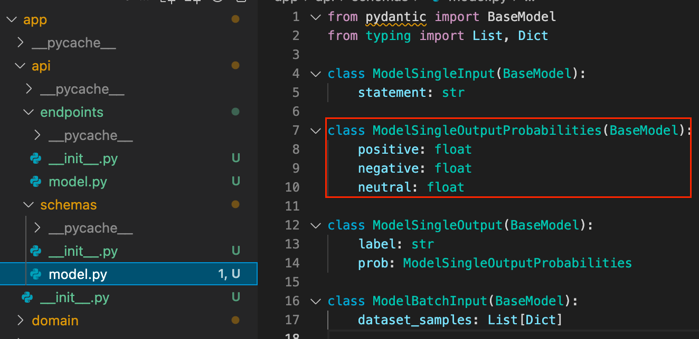
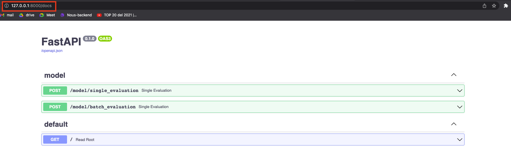

# Dynalab 2.0

## What is Dynalab 2.0?

Dynalab 2.0 is the tool that you are going to use when you want to upload a model to a challenge on dynabench. This tool helps you to get the logic of your model and deploy it in a way the owner of the challenge can evaluate and score the performance of your algorithm.

## Understand the folders

### Folder structure

``` none
    └─ app
    │  ├─ api                  <- Backend logic (Do NOT touch it)
    │  │
    │  ├─ resources            <- Folder to store artifacts
    │  │   ├── tokenizer       <- artifact 1 (you can create it)
    │  │   └── weights         <- artifact 2 (you can create it)
    │  │
    │  └─ domain
    │      └── model.py        <- Script where you have to implement some methods
    │
    └── requirements.txt       <- File to list libraries to install
```

### Foldes contents

Inside the repository you will find a folder called app. This folder contains three folders: api, domain, and resources. The api stores some logic you don't need to update. The resources folder is empty, and that's the place where you want to store your model's components (i.e. weights, tokenizers, processors, etc.). Finally, the domain folder is where you'll be including your models logic. Specifically, look for the model .py file.

## Resources folder

In the resources folder, paste all the artifacts you need in order to call your model:

Artifacts example:

- config.json
- dynasent-r2-test.jsonl
- pytorch_model.bin
- robustness-sst3-test.jsonl
- special_tokens_map.json
- spiece.model
- tokenizer_config.json

Example image:


## Model script

In model script you will find a class called *ModelController* where you can delete everything except by 3 methods *constructor*, *single_evaluation* and *batch_evaluation*. These 2 methods are the ones you have to update in order to make inferences using your model.

An important observation is that you can implement as many methods as you want in order to help *single_evaluation* and *batch_evaluation* to make predictions.

### Single evaluation method

This method is the one you have to update in order to predict just a single example.

### Batch evaluation method

This method is the one you have to update in order to predict a batch of examples (2 or more).

### Checking input format

If you don't know the input format of a function, follow this steps:

1. Go to the endpoint that you are going to test and look for the inputs variables. Look for the variable name you want to check the input type and next to it you are going to find a word.

   

2. Go to /api/schemas/model.py, look for the class with the same name that you find in the previous step and check the variables listed there and that is the input format of that variable.

    

### Checking output format

If you don't know the output format of a function, follow this steps:

1. Go to the endpoint that you are going to test and look for the word **response_model*, next to it you are going to find a word that you are going to keep in mind.

   

2. Go to /api/schemas/model.py, look for the class with the same name that you find in the previous step and check the variables listed there and that is the output format of that variable.

    

## Requirements

Once you add all the files in the resources folder and you update the model.py file, you have to add all the libraries you used to run your model in the requirements.txt file. It is important that you don't delete any library listed before, otherwise your model will not run.

Example:


## Test your implementation

### Run Fast api swagger

Open a new terminal and access to the folder where you have been updating and run the following commands:

``` bash
python3 -m venv env
source env/bin/activate
python3 -m pip install -r requirements.txt
python3 -m uvicorn app.app:app --reload
```

Open your browser and access to localhost:8000/docs. In there, a FastAPI interface should allow you to test the POST request and it should looks like this:



## Test your endpoints

1. Click on the single evaluation method, and then on the 'Try it out' button.

    [try_it_out](img/try_out.png)

2. Fill the request body with your desired input, and click the execute button.

    

3. Check the response code and the output of your model, if everything is OK you will get a 200 code and the response of your model according to the example you sent before.

    

4. Do the same for the batch_evaluation endpoint.

Upload your model once you're done testing, zip the whole repository. Finally, upload the zip file using the 'Upload model' button down below, and finally click on submit model. Congratulations, you've submitted your model to Dynabench.
