# Deploying your decentralized challenge

## Table of Contents

1. [Setting up EC2 instance](#ec2)
   1. [Creating EC2 instance](#create_ec2)
   2. [Installing git](#git)
   3. [Installing docker](#docker)
   4. [Installing nginx](#nginx)
   5. [Open EC2 ports to receive requests](#ec2_ports)
2. [Setting up AWS environment](#aws)
   1. [Establishing AWS region](#region)
   2. [Creating user](#user)
   3. [Creating S3 bucket](#bucket)
   4. [Creating Role arn](#execution_role)
   5. [Creating ECS cluster](#cluster)
   6. [Create SQS queue](#sqs)
3. [Starting the app](#start_app)
   1. [Download the project](#download)
   2. [Access to the correct folder](#folders)
   3. [Install requirements](#requirements)
   4. [Creating .env file](#env)
   5. [Run the API](#run_api)

## Setting up EC2 instance<a name="ec2"></a>

__Note__: The cost of this service depends on the instance you choose and you can see the pricing list [here](https://aws.amazon.com/ec2/pricing/on-demand/).

### Creating EC2 instance <a name="create_ec2"></a>

Create an EC2 instance, add all traffic for port 80 and 22, then access it.

Steps:

1. Click on Launch instances.

    

2.  Select an instance type (according to your choice the cost should change, you can see the pricing list [here](https://aws.amazon.com/ec2/pricing/on-demand/)).

    

3.  Create a new key to connect to your instance.

    

4.  Name your key and press *Create key pair*, it will generate a .pem file that you have to store in a folder you can reach.

    

5. Edit the security group to allow traffic from the internet and SSH connection.

    

6. Rename the security group and make sure you have available port 80 and port 22, if you don't, press the *Add security group rule* button and look for bouth rules.

    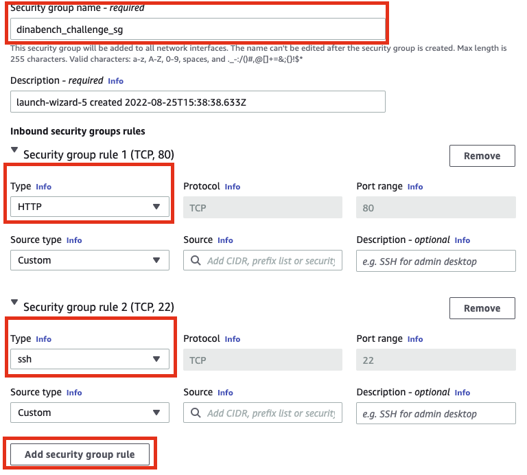

7. Press the *Launch instance* button on the lower right side.

    

8. Go back to EC2, select your instance and click on *Connect*.

    

9. Click on ssh client, open a new terminal on your computer, access to the folder where you store your .pem file generated on step 6 and run the *chmod* and then run the *ssh* command.

    

10. If you did everything well, you will end up with the following view on your terminal.

    

### Installing git <a name="git"></a>

Install git with the following command.

``` bash
sudo yum install git
```

### Installing docker <a name="docker"></a>

Install and run docker with the following commands.

``` bash
sudo yum install docker -y
sudo service docker start
```

After installing docker, make sure you have permissions to run docker commands by running the following:

``` bash
docker images
```

If you run the previous command and you end up with the following message, run the next command.

``` bash
Got permission denied while trying to connect to the Docker daemon socket at unix:///var/run/docker.sock: Get "http://%2Fvar%2Frun%2Fdocker.sock/v1.24/images/json": dial unix /var/run/docker.sock: connect: permission denied
```

Command to run:

``` bash
sudo chmod 777 /var/run/docker.sock
```

### Installing nginx <a name="nginx"></a>

Install nginx with the following command:

``` bash
sudo amazon-linux-extras install nginx1
```

#### Open EC2 ports to receive requests <a name="ec2_ports"></a>

Open the nginx.conf file with the following command:

``` bash
sudo nano /etc/nginx/nginx.conf
```

Replace this file with the following content:

``` none
user nginx;
worker_processes auto;
error_log /var/log/nginx/error.log;
pid /run/nginx.pid;

include /usr/share/nginx/modules/*.conf;

events {
    worker_connections 1024;
}

http {
    log_format  main  '$remote_addr - $remote_user [$time_local] "$request" '
                      '$status $body_bytes_sent "$http_referer" '
                      '"$http_user_agent" "$http_x_forwarded_for"';

    access_log  /var/log/nginx/access.log  main;
    sendfile            on;
    tcp_nopush          on;
    tcp_nodelay         on;
    keepalive_timeout   65;
    types_hash_max_size 4096;

    include             /etc/nginx/mime.types;
    default_type        application/octet-stream;

    server {
        listen       80;
        listen       [::]:80;
        server_name  <**YOUR_INSTANCE_IP_ADRESS example 44.201.16.144**>;

        # Load configuration files for the default server block.
        include /etc/nginx/default.d/*.conf;
        location / {
                proxy_pass http://localhost:8001;
        }
}
}
```

Make sure you update the variable __server_name__ located in the __server__ key in the previous text.

Example:

server_name  32.268.128.174;

In order to get your instance IP adress, open EC2 in your AWS account and click on your instance, then copy the number on the Public IPv4 address part.


Then restart nginx with the following command:

``` bash
sudo service nginx restart
```

## Setting up AWS environment <a name="aws"></a>

### Establishing AWS region <a name="region"></a>

__Note__: This service is free.

Define a region where you are going to deploy all these services.
Make sure you store the name because you are going to add it to a .env file.
Example variable name:

- AWS_REGION=us-east-1

If you don't know how to see a list of the regions, check the following [link](https://docs.aws.amazon.com/AmazonRDS/latest/UserGuide/Concepts.RegionsAndAvailabilityZones.html).

### Creating user <a name="user"></a>

__Note__: This service is cree.

Create an AWS user with access key and secret access key with the following permissions:

- AmazonEC2ContainerRegistryFullAccess
- AmazonElasticContainerRegistryPublicFullAccess
- AmazonECS_FullAccess
- AmazonS3FullAccess
- AmazonSQSFullAccess

Make sure you store "AWS_ACCESS_KEY_ID" and "AWS_SECRET_ACCESS_KEY" because you'd have to add them to a .env file.
Example variable name:

- AWS_ACCESS_KEY_ID=YOUR_ACCESS_KEY
- AWS_SECRET_ACCESS_KEY=YOUR_SECRET_KEY

Steps:

1. On the left part of the screen click on *Users*.

    

2. On the right part of the screen click on *Add users*.

    

3. Type a name for your user and check the Access key - Programmatic access box, then click on next permissions:

    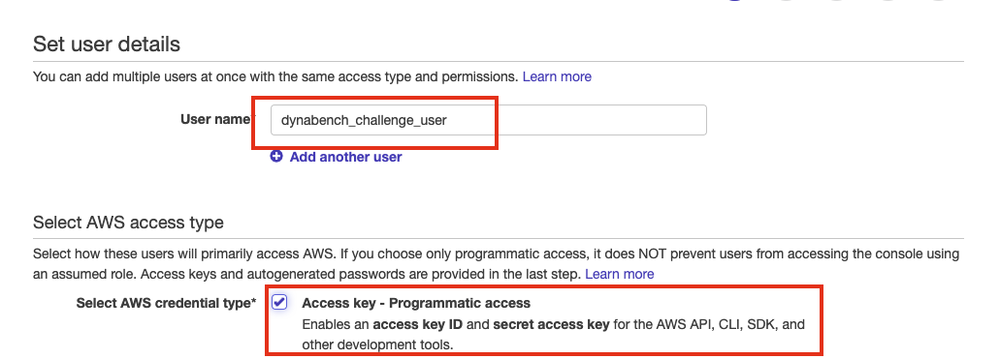

4. Click on create group.

    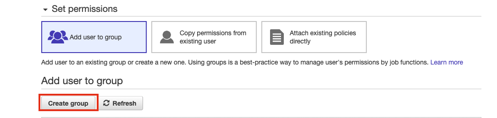

5. Type a name for your group and add all the policies you need for this user by looking for them typing the policies in the search box and checking the box on the left of the policy, then click on *create group*.

    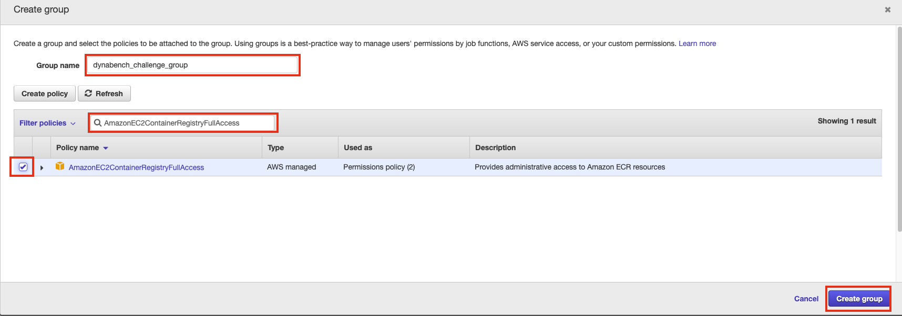

    List of policies:

    - AmazonEC2ContainerRegistryFullAccess
    - AmazonElasticContainerRegistryPublicFullAccess
    - AmazonECS_FullAccess
    - AmazonS3FullAccess
    - AmazonSQSFullAccess

6. Click next 2 times and then click on create group.

7. Click on *Download .csv*, open the file and look for the variables Access key ID and Secret access key. Copy and paste in a secure place these variables from the screen where you are.

    

### Creating S3 bucket <a name="bucket"></a>

__Note__: The cost for this service depends on the size of the files that you upload but creating it is free.

Create an S3 bucket that contains the following structure.

``` none
bucket_name (your bucket name)
    ├── datasets
    │     └── custom challenge name (the name of your challenge)
    │            │
    │            ├── dataset_1.jsonl
    │            └── dataset_1.jsonl
    │
    ├── models
    │     └── custom challenge name (the name of your challenge)
    │            │
    │            ├── model_1.zip
    │            └── model_2.zip
    │
    └── predictions
          └── custom challenge name (the name of your challenge)
```

Make sure you store the name of the bucket because you have to add it to the .env file
example variable name:

- AWS_S3_BUCKET=dynabench-challenge

Add permissions to put objects from arn:aws:iam::877755283837:user/juanciro

Steps:

1. Click on the *create bucket* button.

   

2. Type a name for your bucket and make sure you choose the AWS region you already selected.

   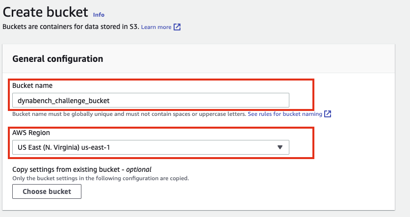

3. Scroll down and click on *Create bucket*.

   

4. Click on your bucket.

   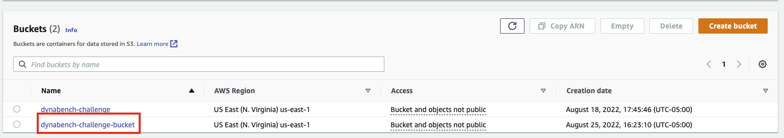

5. Click on *create folder*.

   

6. Type the name of the folder you need and click on *create folder*. Repeat this process until you reach the structure shown before.

   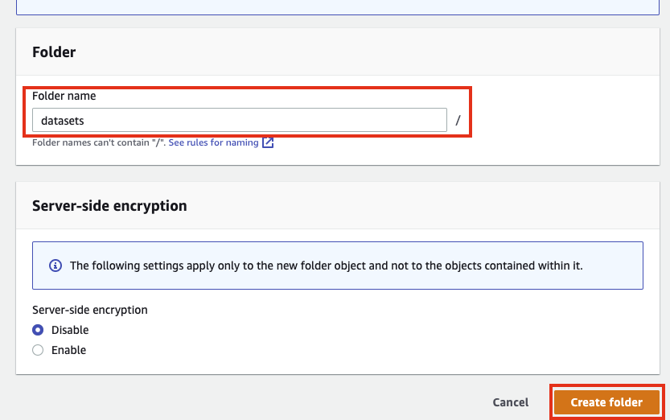

7. Click on your bucket.

   

8. Click on permissions and the click on edit.

    

9. paste the following permissions.

    ``` json
    {
        "Version": "2012-10-17",
        "Id": "Policy1657224070263",
        "Statement": [
            {
                "Sid": "Stmt1657224069060",
                "Effect": "Allow",
                "Principal": {
                    "AWS": "arn:aws:iam::877755283837:user/juanciro"
                },
                "Action": "s3:PutObject",
                "Resource": "arn:aws:s3:::dynabench-challenge-bucket/models/*"
            }
        ]
    }
    ```

10. Click on save changes.

    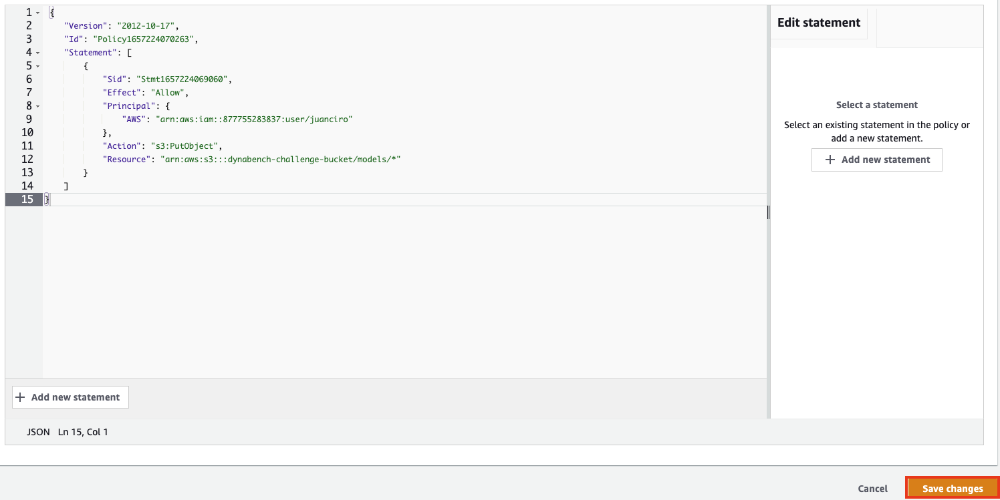

### Creating ECS execution role <a name="execution_role"></a>

__Note__: This service is free.

Create a role with the following permissions:

- AmazonECSTaskExecutionRolePolicy
In trusted relationships, enter the following policy:

``` json

{
    "Version": "2008-10-17",
    "Statement": [
        {
            "Sid": "",
            "Effect": "Allow",
            "Principal": {
                "Service": "ecs-tasks.amazonaws.com"
            },
            "Action": "sts:AssumeRole"
        }
    ]
}
```

Make sure you store the name of the role because you'd have to add it to a .env file.

Example variable name:

- EXECUTION_ROLE_ARN=arn:aws:iam::42676594657:role/dynabench_arn

Steps:

1. On the left side of the screen, click on *roles*.

   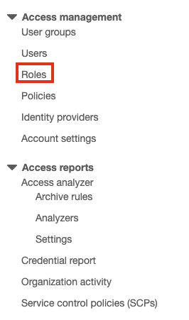

2. On the up right corner of the screen select *create role*.

   

3. Click on *Custom trust policy* and paste the json showed previosly and click on *next*.

   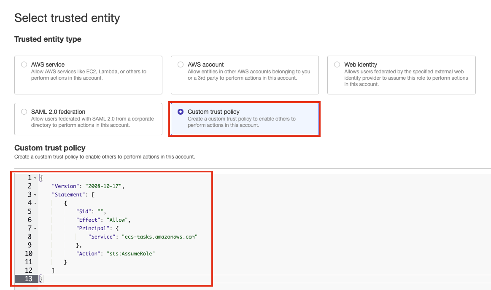

4. Search *AmazonECSTaskExecutionRolePolicy* and add the policy, then click on the *next* button.

   

5. Type a role name and click on *create role*.

   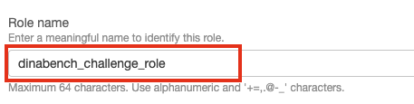

### Creating ECS cluster <a name="cluster"></a>

Create and ECS cluster with 2 subnets, a new VPC and a new security group.
Make sure you store the name of your cluster and name of the 2 subnets because you have to add them to the .env file
example variables names:

CLUSTER_TASK_EVALUATION=YOUR_CLUSTER_NAME

SUBNET_1=YOUR_SUBNET_1

SUBNET_2=YOUR_SUBNET_2

Steps:

1. Click on *Clusters* and then click on *create cluster*.

   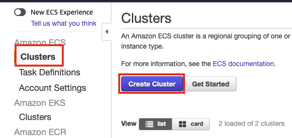

2. Click on *EC2 Linux + Networking* and then on *next step*.

   

3. Type a name for your cluster and select the instance according to your  budget and needs then click on create.

   

### Create SQS queue <a name="sqs"></a>

Create an SQS queue and save the name of the queue because you have to store it on .env file.

Steps:

1. Click on create queue.

   

2. Choose a name for your queue.

   

3. Go to access policy and select Advanced, then delete line 16 and 17.

    

4. Paste the following text at the end of the policy and change the "Resource" value for your arn queue.

    ``` json

    ,
        {
        "Sid": "__owner_statement",
        "Effect": "Allow",
        "Principal": {
            "AWS": "arn:aws:iam::877755283837:user/juanciro"
        },
        "Action": "SQS:*",
        "Resource": <CHANGE THIS VALUE FOR YOUR QUEUE ARN>
        }
    ]
    }
    ```

    

5. Click on create queue.

   

## Starting the app <a name="start_app"></a>

### Download the project <a name="download"></a>

Download repository with the following command:

``` bash
git pull https://github.com/mlcommons/dynabench.git
```

### Access to the correct folder <a name="folders"></a>

Access to new_builder_evaluation folder that contains the backend of the challenge with the following command:

``` bash
cd dynabench/new_builder_evaluation/
```

### Install requirements <a name="requirements"></a>

Install the requirements by running the following command:

``` bash
pip3 install -r requirements.txt
```

### Creating .env file <a name="env"></a>

At this point you have stored 9 variables, but you are missing just one called *CENTRALIZED_URL*. The value for this variable is builder.dynabench.org

Create the .env file by running the following command:

``` bash
sudo nano app/domain/.env
```

Add all the variables that you store in the previous steps and you will end up with a file like the following:

- AWS_ACCESS_KEY_ID=[get here](#user)
- AWS_SECRET_ACCESS_KEY=[get here](#user)
- AWS_REGION=[get here](#region)
- AWS_S3_BUCKET=[get here](#bucket)
- CLUSTER_TASK_EVALUATION=[get here](#cluster)
- SUBNET_1=[get here](#cluster)
- SUBNET_2=[get here](#cluster)
- SECURITY_GROUP=[get here](#cluster)
- EXECUTION_ROLE_ARN=[get here](#execution_role)
- SQS_NEW_BUILDER=[get here](#sqs)
- CENTRALIZED_URL=builder.dynabench.org

### Run the API <a name="run_api"></a>

Run the following command:

``` bash
uvicorn app.app_decentralized:app --port 8001
```

If everything is working well, you can open an internet navigator and enter the following url:

- http://your_EC2_ip_adress/docs

It will open the FastAPI swagger that looks like this


Congratulations!!!, your decentralized project has been deployed.
